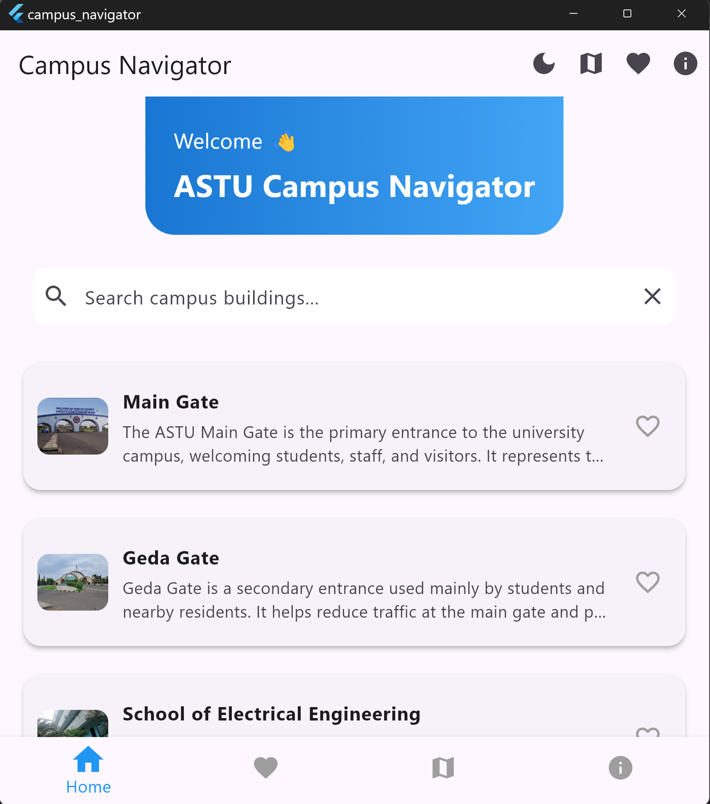
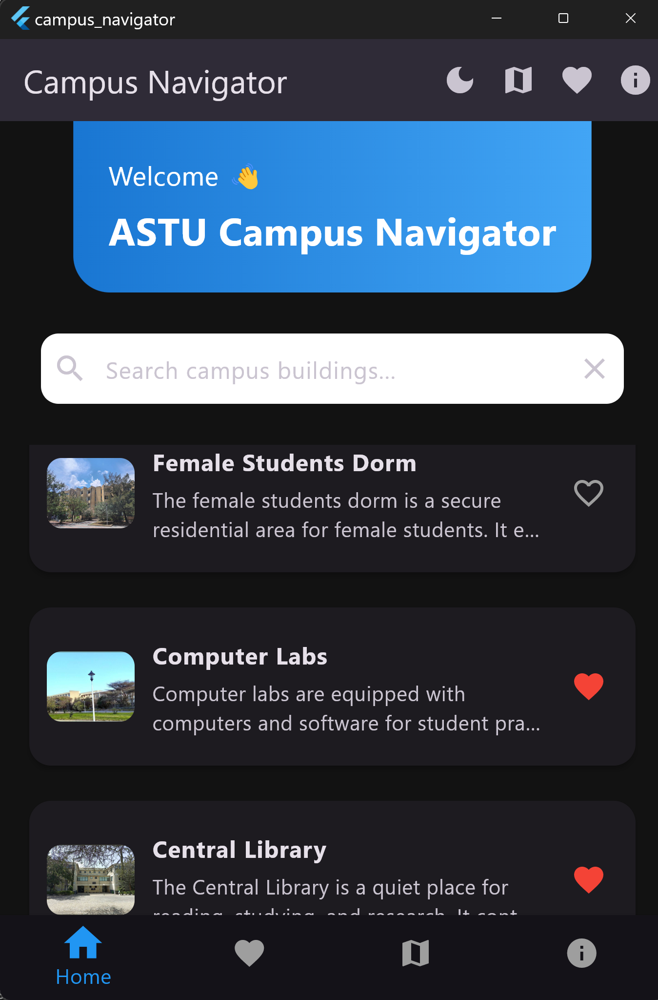
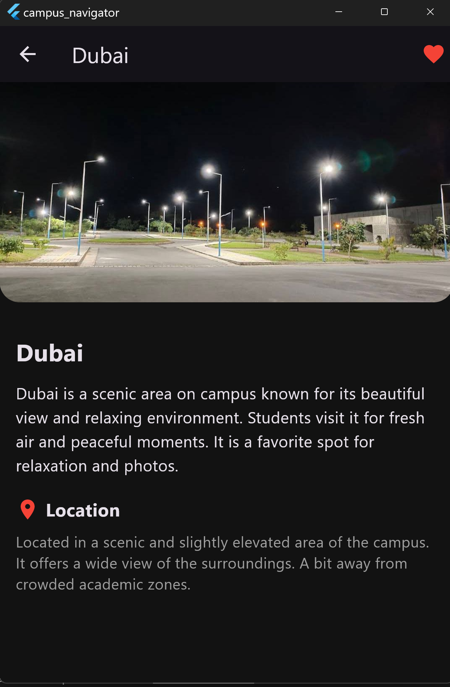
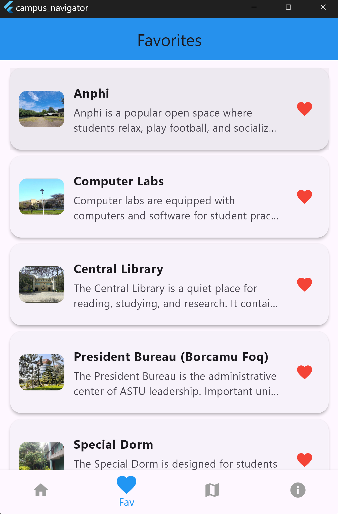
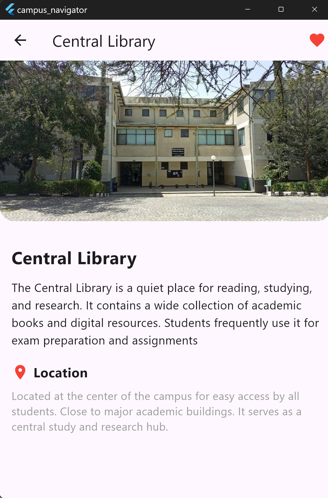
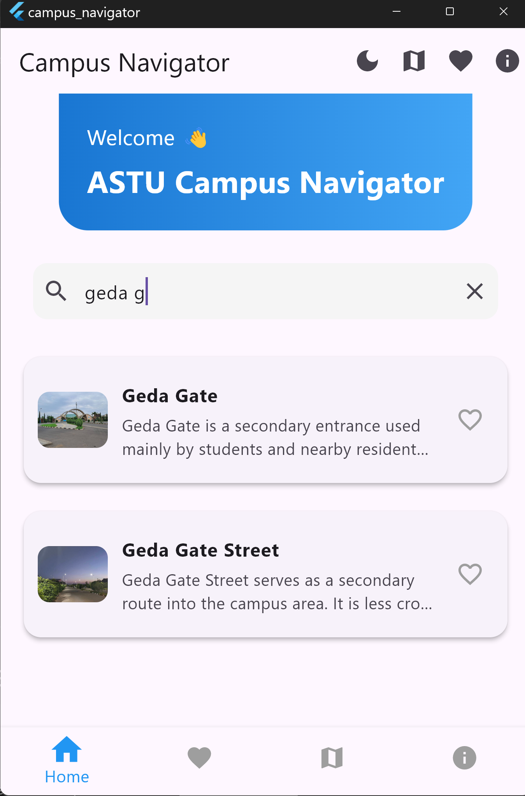

# 📱 Campus Navigator (ASTU)

Campus Navigator is a Flutter-based mobile application designed to help students easily explore and navigate the ASTU campus. The app provides detailed information about buildings, facilities, and important locations, along with images, descriptions, and location guidance.

---

## 🚀 Features

* 🏫 Browse campus buildings and locations
* 🔍 Search for buildings quickly
* ❤️ Add/remove favorites (saved locally)
* 📍 View detailed descriptions and location info
* 🗺️ Map screen for campus overview
* 🌙 Dark mode support
* ✨ Smooth animations and modern UI

---

## 🖼️ App Preview

<p align="center">
  
  
  
  
  
  
</p>

---

## 🛠️ Tech Stack

* **Flutter** (UI Framework)
* **Dart** (Programming Language)
* **SharedPreferences** (Local storage for favorites)

---

## 📂 Project Structure

```
lib/
│
├── main.dart
├── models/
│   └── building.dart
├── data/
│   └── campus_data.dart
├── screens/
│   ├── home_screen.dart
│   ├── building_detail_screen.dart
│   ├── favorites_screen.dart
│   ├── map_screen.dart
│   └── about_screen.dart
├── widgets/
│   ├── building_card.dart
│   ├── search_bar.dart
│   └── custom_appbar.dart
├── utils/
│   ├── constants.dart
│   ├── spacing.dart
│   └── page_route.dart
└── theme/
    └── app_theme.dart
```

---

## ⚙️ Installation & Setup

1. Clone the repository:

```
git clone https://github.com/NoOne-12/campus-navigator.git
```

2. Navigate into the project:

```
cd campus-navigator
```

3. Install dependencies:

```
flutter pub get
```

4. Run the app:

```
flutter run
```

---

## 📊 Dataset

The app includes multiple campus locations such as:

* ASTU Main Gate
* Geda Gate
* Engineering Schools
* Library
* Dormitories
* Cafeteria
* Stadium
* And more...

Each location includes:

* Image
* Description
* Location information

---

## 👥 Team Members

- **[Naol Gelana](https://github.com/NoOne-12)** – UI Design & Main Screen  
- **[Ibsa Magarsa](https://github.com/Ibsa-M)** – UI Components  
- **[Firaol Ararso](https://github.com/san55-web)** – Utilities & Core Logic  
- **[Abduletif Ylkal](https://github.com/let-if)** – Home Screens  
- **[Wogari Ararsa](https://github.com/Wogari-GH6877)** – Navigation & Feature Screens 
- **[Dagim Girma](https://github.com/dagim-hg)** – Data & Architecture 

---

## 📌 Future Improvements

* 🗺️ Real-time map integration (Google Maps)
* 📍 Navigation directions between buildings
* ☁️ Cloud database integration
* 🔐 User authentication

---

